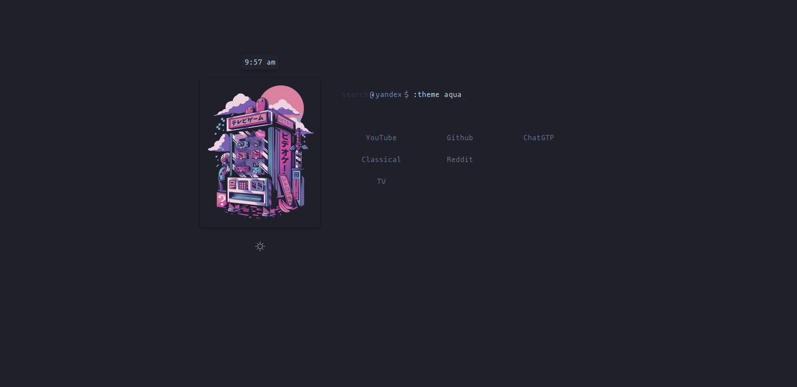

<div align="center">
  <h1> Aesthetic Startpage </h1>
  <i> A distraction free, customizable startpage. </i>
</div>

<br>

<div align="center" style="border-radius:6px;">
  <p>
    
    
    
  </p>
</div>
<br>

<p align="center">
Experience a Visually Enriching New Tab: A sleek, customizable browser startpage designed to enhance your browsing experience and boost productivity. Featuring customizable search bar, multiple default themes, a toggalable night-mode, and quick access to frequently visited websites.
</p>

<hr>

If you've used Brave before, you'll know that you cannot set the home/new-tab background to what you want. If you turn off the crypto ads that are displayed on the home page, it will instead display a, *purposely*, annoying, bright-pink background. To work around this, I'd rather not use some bloated extension just to set something simple.


## Features
- Minimal and stays out of your way, whilst being useful.
- **Customizable Search Bar:** Search the web using your preferred search engine. Easily switch between Google, Yandex, and DuckDuckGo by typing `:search <search_engine>` in the input box. All other strings will search the web using the currently selected search engine.
- **Multiple Themes:** Choose from 3 beautiful default themes, offering unique aesthetics and styles: `catp` (), `aqua` (), `light` (), and `dark`. To switch themes, type `:theme <theme>` in the input box.
- **Quick Access Links:** Conveniently placed beneath the search bar, these links provide easy access to your most frequently visited websites, acting as a lightweight bookmark system.


## Installation

1. Clone or download this repository.

```bash
git clone
```

#### Chromium Browsers:

- Load the startpage as an unpacked extension:
  - Navigate to `chrome://extensions` in your browser.
  - Enable "Developer mode" using the toggle in the top-right corner.
  - Click "Load unpacked" and select the folder `startpage_chrome` inside the downloaded repository.
  - The startpage will now be set as your new tab page.

#### Firefox
It is tedious to sign add-on's for firefox, therefore I have decided to use GitHub pages to host the startpage as a static site.

- Use the `New Tab Override` extension, for example, if you're unable to set custom URLs for home/new-tab page.
- Use this link: yuuushio.github.io/AestheticStartpage/


## Customization

You can further customize the startpage to match your preferences by modifying the `index.html`, `style.css`, and `script.js` files.
- Add or remove quick access links by editing the index.html file.
- Add new **themes**, features or modify existing ones by editing the script.js file.

